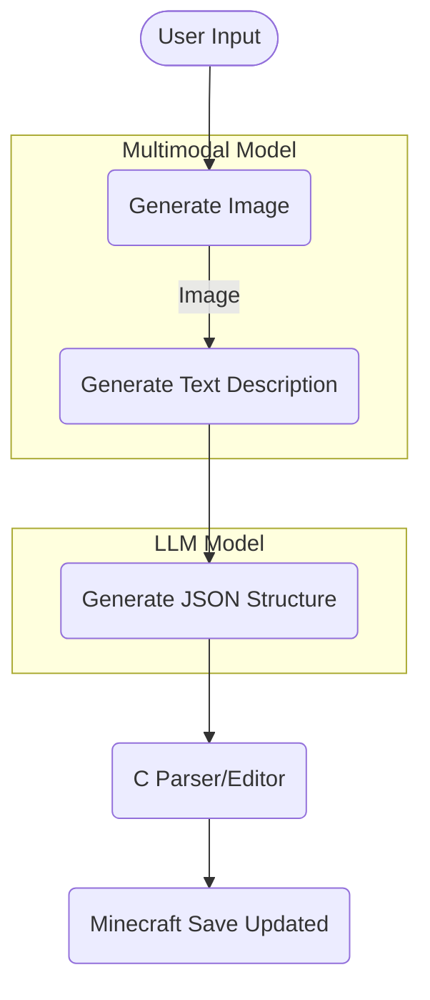

# iBuild

## Table of Contents

- [Overview](#overview)
- [Warning](#warning)
- [Premade AI Presets](#premade-ai-presets)
- [Compiled Releases](#compiled-releases)
- [Usage](#usage)
- [Preview](#preview)
- [How It Works](#how-it-works)
  - [Overall Flow](#overall-flow)
  - [C Code & Minecraft Saves](#c-code--minecraft-saves)
  - [Python Code & UI](#python-code--ui)
- [Local Installation](#local-installation)
  - [Windows Requirements](#windows-requirements)
  - [Mac/Linux Requirements](#mac-requirements)
  - [Install Dependencies](#install-dependencies)
  - [Build the C Library](#build-the-c-library)
- [Credits](#credits)

## Overview

This project is a desktop application that locally runs AI models to generate textual "block data" for Minecraft builds.  
The app automatically downloads these models when needed, so no separate manual download is required.  
It then uses a C-based parser and editor to modify Minecraft region files, placing the AI-generated structure right into a save. Because these AI models run on your machine, a reasonably powerful setup is recommended.

Note: These AI models are fairly small, so the results can often be invalid or just a wall of blocks. This is also my first 'major' project in C and Python (and combining the two), so at least it has been a significant learning journey!

## Warning

**Important:** Do not use this application on Minecraft saves you care about. In some edge cases, the process can corrupt your world data. Always back up or use test saves.

## Premade AI Presets

These are the built-in presets in the application to match various hardware:

1. **Custom**
   - Manually configure GPU layers, CPU threads, etc.
2. **16gb RAM | 10gb VRAM** (32b IQ2_XS)
   - Uses 49 GPU layers on DeepSeek-R1-Distill-Qwen-32B-IQ2_XS.
3. **16gb RAM | 8gb VRAM** (32b IQ2_SX)
   - Uses 39 GPU layers on DeepSeek-R1-Distill-Qwen-32B-IQ2_XS.
4. **16gb RAM | ±6gb VRAM** (7b Q4_K_M)
   - Uses 8 GPU layers on DeepSeek-R1-Distill-Qwen-7B-Q4_K_M.
   - Mostly bad results.

## Compiled Releases

Pre-compiled executables for Windows or Mac may be found on the [Releases page](https://github.com/placeholder-user/placeholder-repo/releases).  
These compiled releases are packaged using PyInstaller.

- Windows with NVIDIA GPU: make sure the CUDA drivers are installed ([Download CUDA Drivers](https://developer.nvidia.com/cuda-12-4-0-download-archive)).
- Download, extract, and run the executable.

## Usage

Models are automatically downloaded into the `models` folder.  
All generated AI output files (like JSON or images) are placed in the `generated_samples` folder.

1. Select your AI preset or define a custom configuration.
2. Type a text prompt describing your Minecraft structure.
3. Optionally choose a save folder and insertion coordinates, then generate.

## Preview

- OS: Windows 11
- CUDA Version: 12.4
- Minecraft Version: Vanilla 1.21.4
- Hardware: 32GB DDR5 RAM | rtx 3080 10GB VRAM
- AI Preset: 10GB VRAM 32b IQ2_XS
- Generation time: 15 minutes

<p align="left">
  
  
</p>

## How It Works

### Overall Flow



1. **Multimodal Step**
   - The program first attempts to generate an "image" representation of your requested structure (using a Janus-Pro 1B multimodal model).
   - It then analyzes this image to create a textual description.
2. **LLM Step**
   - A second local language model (DeepSeek distill) creates the final Minecraft block dataset (JSON structure).
3. **Insertion into Minecraft**
   - The resulting structure is parsed in Python and passed to C code, which updates the relevant Minecraft region files in your chosen save.

### C Code & Minecraft Saves

- The `mc.c` and related files parse the proprietary Minecraft region file format (`.mca`).
- The parser identifies chunk headers, handles compression with zlib, decodes the NBT data, and inserts new block states and palette entries.
- This process must carefully adjust the chunk’s data structures to avoid corrupting the world data.

### Python Code & UI

- The Python side features two major pieces:
  - The UI (`app.py`) built with Tkinter, controlling user inputs, AI presets, and progress feedback.
  - AI integration (`multimodal.py` & `llm.py`) that downloads or references local model files, runs them (via frameworks like `torch` and `llama_cpp`), and produces the “house data” JSON.
  - Finally, `nbt_link.py` calls into the compiled C code via `ctypes`.

## Local Installation

### Windows Requirements

- NVIDIA GPU + CUDA drivers ([Download CUDA Drivers](https://developer.nvidia.com/cuda-12-4-0-download-archive))
- Python
- MinGW-w64 for the C code build

### Mac Requirements

- A suitable C compiler (Clang, GCC, etc.)
- Python

(Linux was not tested)

### Install Dependencies

After cloning the repository, install the Python packages in the top-level directory:

```bash
pip install -e .
```

### Build the C Library

In the `nbt-editor` directory:  
On Mac/Linux:

```bash
make -f Makefile.nix
```

On Windows:

```bash
make -f Makefile.win
```

This produces the shared library (`.so` on Mac/Linux, `.dll` on Windows) in `nbt-editor/build`.

### Starting the Python GUI

After building the C library and installing Python packages, run the Python GUI:

```bash
python py-ui/app.py
```

## Credits

- [zf_log](https://github.com/wonder-mice/zf_log) for C-side logging.
- [Janus](https://github.com/deepseek-ai/Janus/tree/main) for Janus-Pro Python library.
